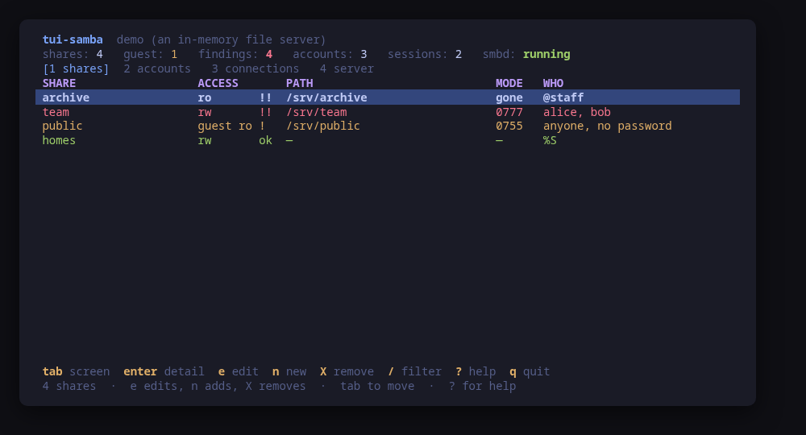
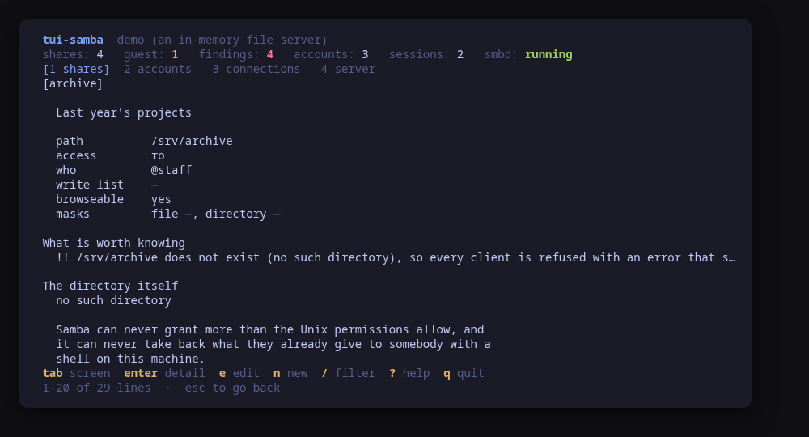
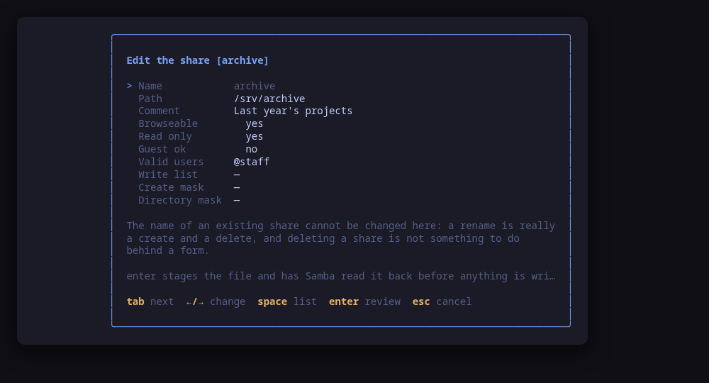
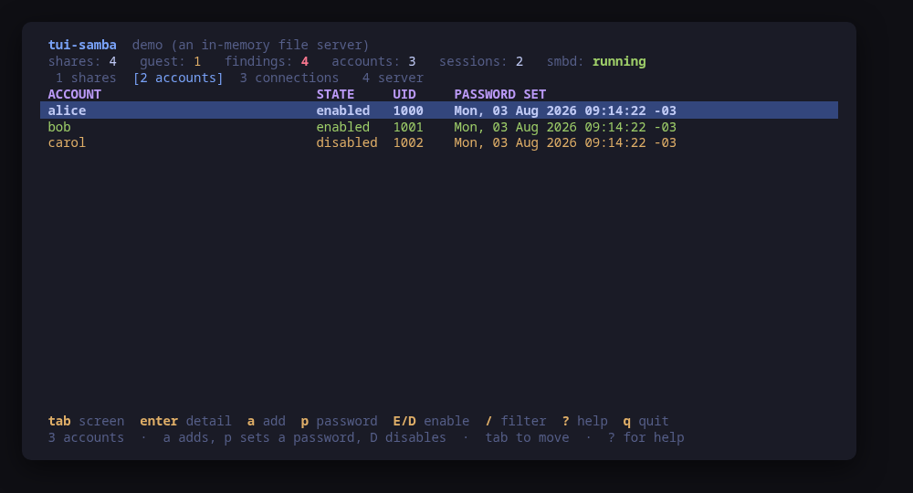
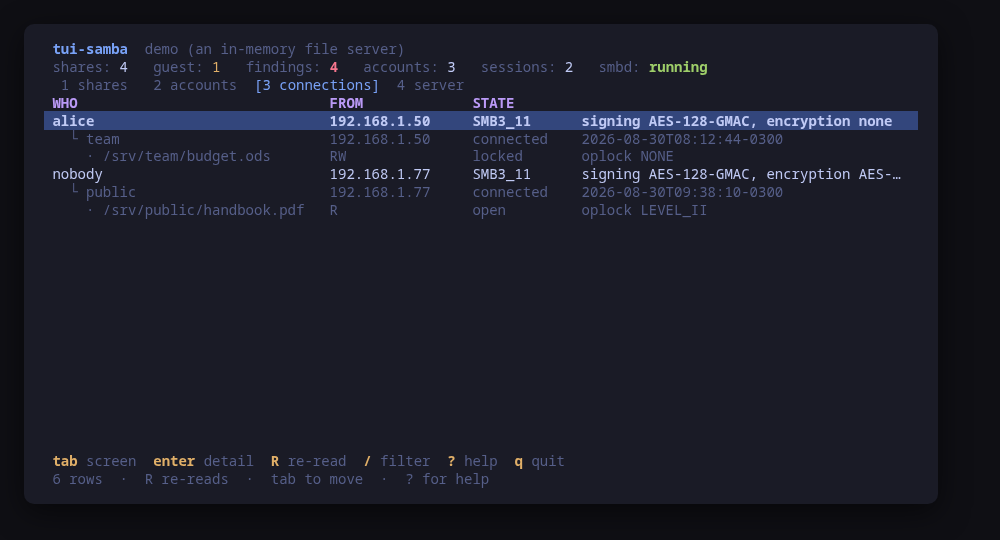
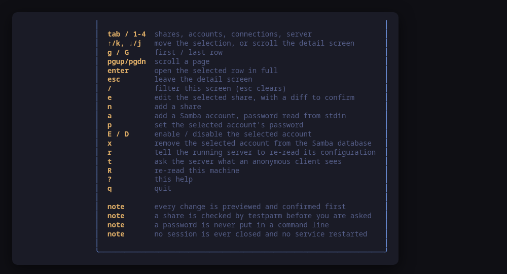

A terminal UI for the Samba file server on this machine: the shares it exports,
the accounts that can reach them, and who is connected right now. It lists the
shares **worst first**, and it **previews the exact command line of every change
before running it**.

Nothing else on a Linux box puts those together. `testparm -s` for the effective
configuration, `stat` on every path to find out what the Unix side really
allows, `pdbedit -L -v` for the accounts, `smbstatus` for the sessions, and
`systemctl status smb` — or `smbd`, depending on the distribution — to find out
whether any of it is running. `tui-samba` puts them on one screen, in the
[Omarchy](https://omarchy.org) visual style.



> **Status: early, under validation.** An independent tool that follows the
> Omarchy visual style; it is **not** part of the Omarchy project and not
> endorsed by its maintainers. Expect rough edges.

## Install

<!-- install:start -->
<!-- Generated by tui-kit/tools/render-install.py from tool.json. -->
<!-- Edit the manifest, then run `make readme`. -->

### Arch Linux

Needs the tui-tools repository, which is a [one-time
setup](https://tui-tools.github.io/install/).

The one-liner detects the distribution and adds the repository and its signing
key:

```sh
curl -fsSL https://pkgs.tui.tools/install.sh | sh
```

Piping a script into a shell is not this family's style, so here is the same
setup by hand — read it, or read the script first with `curl -fsSL
https://pkgs.tui.tools/install.sh -o install.sh`:

```sh
curl -fsSL -o /tmp/tui-tools.asc https://pkgs.tui.tools/pubkey.asc
sudo pacman-key --add /tmp/tui-tools.asc
sudo pacman-key --lsign-key \
  "$(gpg --show-keys --with-colons /tmp/tui-tools.asc | awk -F: '/^fpr:/{print $10; exit}')"
printf '[tui-tools]\nServer = https://pkgs.tui.tools/arch/$arch\n' \
  | sudo tee -a /etc/pacman.conf
sudo pacman -Sy
```

Then, and for every other tool in the family:

```sh
sudo pacman -S tui-samba
```

Upgrades then arrive with the rest of your system updates.

### Debian and Ubuntu

Needs the tui-tools repository, which is a [one-time
setup](https://tui-tools.github.io/install/).

The one-liner detects the distribution and adds the repository and its signing
key:

```sh
curl -fsSL https://pkgs.tui.tools/install.sh | sh
```

Piping a script into a shell is not this family's style, so here is the same
setup by hand — read it, or read the script first with `curl -fsSL
https://pkgs.tui.tools/install.sh -o install.sh`:

```sh
sudo install -d -m 0755 /etc/apt/keyrings
curl -fsSL https://pkgs.tui.tools/pubkey.asc \
  | sudo gpg --dearmor -o /etc/apt/keyrings/tui-tools.gpg
echo "deb [signed-by=/etc/apt/keyrings/tui-tools.gpg] https://pkgs.tui.tools/deb stable main" \
  | sudo tee /etc/apt/sources.list.d/tui-tools.list
sudo apt update
```

Then, and for every other tool in the family:

```sh
sudo apt install tui-samba
```

Upgrades then arrive with the rest of your system updates.

### Fedora and RHEL

Needs the tui-tools repository, which is a [one-time
setup](https://tui-tools.github.io/install/).

The one-liner detects the distribution and adds the repository and its signing
key:

```sh
curl -fsSL https://pkgs.tui.tools/install.sh | sh
```

Piping a script into a shell is not this family's style, so here is the same
setup by hand — read it, or read the script first with `curl -fsSL
https://pkgs.tui.tools/install.sh -o install.sh`:

```sh
sudo rpm --import https://pkgs.tui.tools/pubkey.asc
sudo curl -fsSL -o /etc/yum.repos.d/tui-tools.repo https://pkgs.tui.tools/rpm/tui-tools.repo
sudo dnf makecache
```

Then, and for every other tool in the family:

```sh
sudo dnf install tui-samba
```

Upgrades then arrive with the rest of your system updates.

### Any distribution, static binary

```sh
curl -fsSL https://github.com/tui-tools/tui-samba/releases/download/v0.1.1/tui-samba_0.1.1_linux_amd64.tar.gz | tar -xz tui-samba
sudo install -m0755 tui-samba /usr/local/bin/tui-samba
```

One static binary. Verify it against checksums.txt from the same release.

### From source

```sh
git clone https://github.com/tui-tools/tui-samba
cd tui-samba && make build
sudo install -m0755 bin/tui-samba /usr/local/bin/tui-samba
```

Needs Go 1.27 or newer.

Not packaged for these yet; the static binary works everywhere in the meantime.

### Arch Linux (AUR) — coming soon

```sh
paru -S tui-samba-bin
```

The -bin package installs the released static binary.

### openSUSE — coming soon

Needs the tui-tools repository, which is a [one-time
setup](https://tui-tools.github.io/install/).

```sh
sudo zypper install tui-samba
```

The rpm repository is shared with dnf; zypper support is not tested yet.

### Verify a download

Every release of `tui-samba` ships a `checksums.txt`. Check an archive against
it before installing:

```sh
sha256sum -c checksums.txt --ignore-missing
```
<!-- install:end -->

One static binary, no daemon, no state of its own. Nothing keeps running after
you quit.

## Try it without root

```sh
tui-samba --demo
```

`--demo` runs against a sample file server with four shares in the states a real
one is found in: a read-only share anyone can open, the `[homes]` stanza every
distribution ships, a writable team share whose directory somebody fixed with
`chmod 777`, and one whose directory is simply gone. Three accounts, one of them
disabled. Two clients connected with a file open each. Every key works, every
command is built and previewed for real, and nothing touches your system.

The sample server holds a real `smb.conf` and a real drop-in, and the demo reads
them through the same parser the real backend uses — `include` expanded the way
`testparm` expands it. So an edit made in the demo produces the same diff it
would produce on your machine.

## A file server, not a domain controller

Samba is two products in one source tree. This tool is for the first one: shares
on a machine, reached over SMB, with accounts in Samba's own password database.

**Active Directory is out of scope.** No `samba-tool`, no domain, no DNS, no
replication, no trusts, no group policy. A domain controller is a different
program with a different database and a different set of ways to break, and a
tool that pretended to cover both would cover neither.

## What it reads, and why that

The configuration comes from **`testparm -s`**, not from parsing `smb.conf`. That
is the difference between what the server resolved and what somebody typed:
every `include` expanded, every synonym normalised, every inherited value filled
in. When a share does not behave, "what somebody typed" is exactly the thing
being asked about.

`testparm --show-all-parameters` is deliberately **not** used — it prints every
parameter Samba has, not this server's.

Beside every share is the half of the answer Samba never gives you:

- the directory's Unix **mode, owner and group**, because Samba can never grant
  more than they allow, and can never take back what they already give to
  somebody with a shell on the machine;
- its **SELinux label**, on a machine where SELinux is loaded, along with
  `samba_export_all_rw` and `samba_export_all_ro`. On Fedora and RHEL a share
  can be right in `smb.conf`, right in its modes, and still refuse every client
  because of these, and nothing Samba prints says so;
- whether **anything is listening** on 445 and 139, read from `ss -tlnp`. A
  perfect configuration on a machine whose `smbd` is not running looks the same
  on paper as one that works.

The service unit is asked for by the name it really has here: Fedora and Arch
ship `smb.service`, Debian and Ubuntu ship `smbd.service`, and all of them are
asked so nothing on screen is a guess.

## Findings first

The list is not sorted by name. It is sorted by what needs you today:

| | |
| --- | --- |
| `!!` | the share's path **does not exist** — every client sees an error that says nothing about a missing directory |
| `!!` | the directory is **world-writable**: every account on the machine can write to it, whatever the share says |
| `!!` | `guest ok = yes` with `read only = no` — anybody who reaches the port can write, with no password |
| `!!` | `server min protocol` below SMB2: this server still speaks **SMB1** |
| `!!` | `security = share`, removed in Samba 4.0 and doing nothing here |
| `!` | writable with no `valid users` and no `write list`: every account in the database can write |
| `!` | `map to guest = Bad User` on a server with guest shares — an unknown username becomes the guest instead of being refused |

Two of those are deliberately quieter than a checklist would have them. A server
that never set `server min protocol` raises **nothing**: SMB1 has been off by
default since Samba 4.11, and flagging the default would flag every machine.
`[homes]` raises nothing either — it is on by default everywhere and it is not a
mistake. A list that flags what everybody runs teaches you to stop reading the
list.



`enter` opens the row: the findings, the directory's own permissions and label,
who has the share open right now, and **every effective parameter** the server
resolved for it — so a setting this tool has no field for is still visible.

## Changing a share



`e` edits the selected share and `n` adds one, through a form with ten fields and
no free-text surprises. The form warns about the combination that turns a file
server into a drop box **as it becomes true**, rather than after it is written.

Then, before you are asked anything:

1. the new file is **staged** to a private temporary directory, mode 0600;
2. **`testparm -s`** — Samba's own parser — reads it back;
3. the confirm dialog shows what Samba said, a **unified diff** of the file, who
   is connected to the share right now, and the exact commands.

Only then:

```
install -m 644 /tmp/tui-samba-xxxx/team.conf /etc/samba/tui-samba.d/team.conf
install -m 644 /tmp/tui-samba-xxxx/smb.conf  /etc/samba/smb.conf
smbcontrol all reload-config
```

`install` rather than `cp`, because it sets the mode in the same call and leaves
no window where the file is on disk with the wrong one. `reload-config` rather
than a restart: every `smbd` re-reads its files and **keeps serving**, so a
client mid-copy does not notice. `tui-samba` never restarts the service.

### Which file it writes

One definition per share, and never two:

- a share **already written in `smb.conf`** is edited there, in place. The stanza
  is replaced line by line, so every comment, every blank line and every other
  share in the file survives untouched — an `smb.conf` is usually the
  distribution's own with three lines added, and regenerating it would replace a
  documented file with a dump of Samba's defaults;
- anything else — a new share, or one this tool wrote before — goes to
  **`/etc/samba/tui-samba.d/<name>.conf`**, a file this tool owns and you can
  delete without picking apart somebody else's configuration.

A drop-in Samba is not told to read is a file that does nothing, so the one line
that reaches it is part of the same change: `include = …` is added to `[global]`,
and the dialog says so. Samba's `include` is a literal textual inclusion
processed where it appears — there is no include-a-directory form, and inventing
one would be inventing a Samba feature.

A share is **never renamed** and never deleted. A rename is really a create and a
delete, and deleting a share is not something to do behind a form field somebody
tabbed through.

The parameters the form does not ask about are **kept exactly as they were**. A
share with a `vfs objects` or a `hosts allow` survives an edit here untouched.

## Accounts



`2` is Samba's own password database, read with `pdbedit -L -v`. The verbose form
because the one-line form carries no flags, and the flags are the whole point: an
account that is in the database and **disabled** looks exactly like one that
works, right up until somebody tries it.

A Samba account is **not** a Unix account. It is an entry that maps to the Unix
account of the same name, which is what decides file permissions once somebody
is in — so an entry whose Unix account is gone is an entry nobody can ever log in
as, and Samba itself says nothing about it. This screen does, and points at
[tui-users](https://github.com/tui-tools/tui-users) for the other half.

`a` adds, `p` sets a password, `E`/`D` enable and disable, `x` removes the Samba
entry and leaves the Unix account exactly as it is.

**A password is never put in a command line.** `smbpasswd` is driven with `-s`,
which reads it from standard input — a command line is visible in `ps` to every
account on the machine, and a password on one is a password disclosed. It is
masked on the way in, it is absent from the confirm dialog, and it is absent from
the preview, which is why the preview can show the command in full.

## Who is connected



`3` is `smbstatus`: the sessions, the shares each one has open, and the files
under them, as one list — because the question a reader arrives with is "who is
on this server and what are they doing".

On Samba 4.17 and newer it is read from **`smbstatus --json`**, so the dialect,
the signing and the encryption come from Samba's own document rather than from
columns separated by runs of spaces a value may also contain. Older servers are
read from the text output, which carries the same sessions, connections and open
files with less around them; the screen says which was used.

This screen is **read-only in v0.1**. Closing somebody's session is a thing this
tool could build a command for and deliberately does not: a client disconnected
mid-write loses the write, and no dialog makes that safe enough to put behind a
key.

## The server itself

`4` is what is running, what is listening, and how the server authenticates:
the units by their real names, the ports, the workgroup, `security`,
`map to guest`, the dialect window, every `include` line, and the SELinux state
with the two `samba_export` booleans.

`r` reloads the configuration. `t` runs `smbclient -L localhost -N` and shows
what came back — the share list an **anonymous client on the network** is given,
which is a different question from what the configuration says: a share that is
not browseable is real and will not be in it.

## Usage

```sh
tui-samba                        # read this machine
tui-samba --demo                 # sample server, no privileges needed
tui-samba --check                # read, print JSON, exit
tui-samba --config /srv/smb.conf # a Samba built with a different prefix
tui-samba --theme ~/mytheme/colors.toml
tui-samba --sudo ""              # run the commands directly (as root)
tui-samba --version
```

### `--check`, for scripts and tests

`--check` is the non-interactive read path: it loads the machine through the same
backend the UI would use, prints what it parsed as JSON and exits 0, or exits 1
with the reason if the backend cannot be read. No UI, no mutation.

```console
$ tui-samba --check | head -14
{
  "tool": "tui-samba",
  "version": "0.1.0",
  "backend": "samba",
  "describe": "samba",
  "installed": true,
  "serverVersion": "4.20.5",
  "shares": 4,
  "writable": 2,
  "guest": 1,
  "pathMissing": 1,
  "users": 3,
  "disabledUsers": 1,
  "sessions": 2,
```

A machine with **no Samba on it** is a real machine — most machines are like that
— and `"installed": false` with the reason beside it is the true answer for it,
with exit code 0. The units and the ports are still reported, so the shape of the
report does not change between a machine with a file server and one without.

It exists so a test can assert on what the tool *parsed* rather than on what it
painted. [tui-lab](https://github.com/tui-tools/tui-lab) uses it to test this
tool against real machines on Ubuntu, Fedora and Arch; the assertions live in
[`test/smoke.sh`](test/smoke.sh), and every one of them is read-only.

## What it can do to your machine

Every one of these is previewed and confirmed first.

| Key | What runs |
| --- | --- |
| `e` / `n` | `install -d -m 755 /etc/samba/tui-samba.d` (when missing), then `install -m 644 <staged> <destination>`, then `smbcontrol all reload-config` |
| `a` | `smbpasswd -a -s <name>`, password on standard input |
| `p` | `smbpasswd -s <name>`, the same way |
| `E` / `D` | `smbpasswd -e <name>` / `smbpasswd -d <name>` |
| `x` | `smbpasswd -x <name>` |
| `r` | `smbcontrol all reload-config` |
| `t` | `smbclient -L localhost -N` (a read, confirmed because it connects) |

Nothing else. There is no other code path that writes a file, and the only two
files ever written are `/etc/samba/smb.conf` and a `.conf` under
`/etc/samba/tui-samba.d` — both checked at the point the command is built, so
nothing that reaches an argv can widen that.

## Keys

| Key | Action |
| --- | --- |
| `tab` / `1`–`4` | Move between shares, accounts, connections and the server |
| `↑`/`k`, `↓`/`j` | Move the selection, or scroll the detail screen |
| `g` / `G` | First / last row |
| `pgup` / `pgdn` | Scroll a page |
| `enter` | Open the selected row in full |
| `esc` | Leave the detail screen |
| `/` | Filter this screen (`esc` clears) |
| `e` | Edit the selected share, checked and diffed first |
| `n` | Add a share |
| `a` | Add a Samba account |
| `p` | Set the selected account's password |
| `E` / `D` | Enable / disable the selected account |
| `x` | Remove the selected account from the Samba database |
| `r` | Tell the running server to re-read its configuration |
| `t` | Ask the server what an anonymous client sees |
| `R` | Re-read this machine |
| `?` | Help |
| `q` | Quit |

In the **editor**: `tab` moves between fields, `←`/`→` cycles a choice, `space`
opens the list, `enter` stages the file and has Samba read it back, `esc`
cancels.



## What v0.1 can do

- List every share the server resolved, with its path, access, `valid users`,
  `write list`, masks, `vfs objects` and every other effective parameter.
- Cross each one against the Unix side: existence, mode, owner, group,
  world-writability and the SELinux label.
- Judge the lot: missing path, world-writable directory, guest-writable share, no
  access control at all, SMB1, `security = share`, and a guest mapping that lets
  an unknown username in.
- Read the Samba password database with the account flags, and say which entries
  have no Unix account behind them.
- Show the live sessions, the shares they have open and the files under them,
  from `smbstatus --json` where there is one and from the text output where there
  is not.
- Report the units by their real names, whether they are enabled and running, and
  what is listening on 445 and 139.
- Edit or add a share through a guided form, staged, checked by `testparm` and
  shown as a diff before anything is written.
- Add, remove, enable, disable an account and set its password, with the password
  never in a command line.
- Reload the running server, and ask it what an anonymous client sees.
- Follow the active Omarchy theme, and respect `NO_COLOR`.

## What v0.1 cannot do

- **No Active Directory.** No domain controller, no `samba-tool`, no domain
  join, no DNS, no group policy, no trusts.
- **No share is ever deleted or renamed**, and `[global]`, `[homes]`,
  `[printers]` and `[print$]` are shown and never rewritten.
- **No session is ever closed.** `smbcontrol <pid> close-share` exists and is
  deliberately not offered: a client disconnected mid-write loses the write.
- **The service is never started, stopped or restarted.** `smbd` is asked its
  version and nothing else; a configuration change is picked up with a reload.
- **No Unix accounts, no groups, no ACLs.** Creating the Unix account a Samba
  entry maps to is [tui-users](https://github.com/tui-tools/tui-users)' job, and
  `setfacl` is nobody's here.
- **No printing.** `[printers]` is listed and left alone.
- **No client side.** It does not mount anything, and it does not browse the
  network for other servers.
- **No `smb.conf` variables are expanded.** `%S`, `%U` and `%h` are shown as
  Samba resolved them into the effective configuration, which for a per-client
  variable means shown as written.

## Compatibility

<!-- compat:start -->
<!-- Generated by tui-kit/tools/render-compat.py from tool.json. -->
<!-- Edit the manifest, then run `make readme`. -->

`tui-samba` probes its backend once at startup and shows the version in the
header. A version nobody has tested is marked `(untested)` there rather than
hidden; one below the minimum is marked as such and the tool still runs.

### samba

| | |
| --- | --- |
| Binary | `smbd` |
| Version read with | `smbd --version` |
| Minimum | 4.11 |
| Tested | `4.24.6` |
| Version-gated features | `status-json` (since 4.17) |

| Versions | What changes |
| --- | --- |
| `<4.17` | `smbstatus --json` does not exist, so the connections are read from the text output; the sessions, the shares in use and the open files are all there, and the per-session encryption is whatever those columns carry |
| `>=4.17` | `smbstatus --json` is used, so a session's dialect, signing and encryption come from Samba's own document instead of from columns separated by runs of spaces a value may also contain |
| `>=4.11` | SMB1 is off by default from this release, so a `server min protocol` below SMB2 is something somebody set on purpose — which is why tui-samba raises it and says nothing about a server on the default |
| `>=4.11` | `testparm --show-all-parameters` is not used at all: it prints every parameter Samba has rather than this server's, so the effective configuration comes from `testparm -s` |
| `>=4.11` | a machine may have no Samba at all, and that is a normal machine rather than a failure: the tool says so on its first screen and `--check` reports it as `"installed": false` and exits 0 |

The tested versions are generated from `compat/results.jsonl`, which the tool's
own smoke test appends to when it runs against a real machine in
[tui-lab](https://github.com/tui-tools/tui-lab).
<!-- compat:end -->

## Configuration

`/etc/tui-samba/config.toml`, then `~/.config/tui-samba/config.toml` (the user
file overrides the machine-wide one), then `TUI_SAMBA_*` in the environment.
Flags override everything. See [`examples/config.toml`](examples/config.toml).

```toml
# Where smb.conf is; empty asks the server itself.
config = ""

# Privilege escalation prefix; "" runs the command directly.
sudo = "sudo -n"

# Path to an Omarchy-style colors.toml; empty follows the active theme.
theme = ""
```

## Theme

The default palette is **Tokyo Night**. On Omarchy, the tool reads the active
desktop theme from `~/.config/omarchy/current/theme/colors.toml` and follows it.
`TUI_THEME` or `--theme` override; `NO_COLOR` drops color and keeps layout. The
rules live in [tui-kit](https://github.com/tui-tools/tui-kit#theme-rules).

## Architecture

The UI never builds a `testparm`, `pdbedit` or `smbpasswd` command line, and
never opens a file. It talks to `internal/shares.Backend`, which returns a
tool-neutral model:

```
Model{Global, Shares, Users, Sessions, TreeConnects, OpenFiles, Services,
      Ports, SELinux, Installed}
Share{Name, Path, ReadOnly, GuestOK, Browseable, ValidUsers, WriteList,
      CreateMask, DirectoryMask, VFSObjects, Params, Raw, Dir, Verdict,
      Findings}
DirInfo{Path, Exists, Mode, Owner, Group, WorldWritable, SELinuxContext}
User{Name, UID, Flags, Disabled, NoPassword, PasswordLastSet, UnixPresent}
Session{PID, User, Machine, Protocol, Encryption, Signing}
```

`internal/samba` is the only package that starts a process, and it starts one for
twelve programs — `smbd`, `testparm`, `pdbedit`, `smbpasswd`, `smbstatus`,
`smbcontrol`, `smbclient`, `systemctl`, `ss`, `install`, `getenforce` and
`getsebool` — plus `cat`, `stat` and `ls` as the escalated fallbacks for a file
or a directory an ordinary user cannot open.
[`check-exec.sh`](https://github.com/tui-tools/tui-kit/blob/main/tools/check-exec.sh)
fails the build if any other package imports `os/exec`.

Every parser is a pure function of a string and is covered by a fixture of real
output in `internal/samba/testdata` — `testparm -s`, `pdbedit -L -v`, `smbstatus`
in both forms, `ss -tlnp`, `systemctl show`, `getsebool`, `stat` and `ls -Z`. The
JSON one is the example document from Samba's own `smbstatus` manual page.

Mutations are `runner.Command` values produced by the backend. The UI shows them
and, on confirmation, hands the same ones back to the
[kit runner](https://github.com/tui-tools/tui-kit#the-contract-preview-confirm-run),
which resolves the binary and the privilege prefix. That is the whole trust
boundary, and it is why the preview is guaranteed to match what executes.

## Development

```sh
make check        # gofmt, go vet, the exec boundary and the tests: what CI runs
make test
make build
make demo
make screenshots  # re-render the frames above from --demo
```

Dependencies are deliberately small: Bubble Tea, Bubbles and
[tui-kit](https://github.com/tui-tools/tui-kit), which carries the palette, the
widgets, the config loader and the command runner shared by the whole family.

## Safety notes

- **A world-writable share directory is not fixed by `read only = yes`.** The
  share stops writes over SMB; it does nothing about anybody with a shell.
- **Removing a Samba account does not remove the Unix account**, and disabling
  one keeps its password. Disabling is what to do when somebody may come back.
- **A reload is not a restart.** Connected clients stay connected, and a client
  already inside a share keeps the access it was granted until it reconnects —
  so tightening a share does not take effect for the people who are in it.
- **The password database and `smbstatus` are root-only.** An unprivileged run
  reports the shares and says why the accounts and sessions are missing, rather
  than showing an empty server.
- Reading `smb.conf` escalates through `sudo -n` only after a plain read has
  already been refused, which on nearly every machine never happens.
- `tui-samba` re-reads the machine after every change, so what you see is what
  the system reports, not what the tool assumed.

## License

MIT — see [LICENSE](LICENSE). Part of the
[tui-tools](https://github.com/tui-tools) family.
